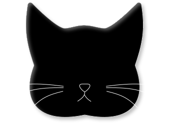

# 🐾 Meow Cat: No Thoughts. Just Fluff.

<p align="center">
  
</p>
<p align="center">
  <a href="https://your-vercel-link.vercel.app"><b>👀 View the Live Website Here</b></a>
</p>

*Mrrrp?* Oh, you’re here. Wipe your paws before entering my repository. 

I am the supreme feline overlord of **Meow Cat**, and I graciously allowed my human servant to type this up while I sat directly on their keyboard. This web application is a monument to my greatness—a fun, interactive, and educational site dedicated entirely to ME (and my fluffy brethren). From decoding my mysterious tail twitches to figuring out how old I *actually* am, this project combines a playful UI with smooth animations. 

Now, sit still. I am going to explain how my website works. *Purrrr.*

---

## 🖤 The Face of Perfection (My Logo)

Why this logo, you ask? Look at it. It is *me*. Perfectly captured in scalable vector graphics. 

Notice the piercing eyes judging your code, the aerodynamic ears ready to ignore your commands, and the sleek silhouette designed specifically to blend into your pile of clean laundry. My human servant spent hours in Figma trying to capture my divine essence, and I only stepped on their mouse twice while they did it. I consider it a masterpiece.

---

## 🧶 The Shiny String (Tech Stack)

What did the human use to build my digital scratching post? Let me bat these bullet points around for you:

*   🎨 **Figma:** Where the human drew pictures of me (UI/UX design and SVG assets).
*   🚀 **Next.js:** This makes the pages load faster than I zoom down the hallway at 3:00 AM. (Seamless routing and optimized performance).
*   💅 **HTML5 & CSS3:** The invisible boxes I like to sit in. Features custom responsive layouts, CSS variables, and extensive keyframe animations.
*   🐟 **Firebase Database:** Where I hoard your feedback securely, exactly like I hoard stolen milk jug rings under the refrigerator.
*   🧠 **Cat Fact API:** (`https://catfact.ninja/fact`) Used to fetch random facts about my species, because you humans desperately need to be educated.

---

## 🗺️ My Domain (Pages & Features)

The website is a Single Page Application (SPA). That means no annoying page reloads—just smooth transitions, exactly like how I transition from sleeping on the couch to sleeping on your clean laundry. 

### 1. 🏠 Home Page
"No Thoughts. Just Fluff." That is my life motto.
*   **Dynamic Hero Text:** The text cascades onto the screen using a staggered CSS `fadeInUp` animation. It looks like a waterfall. I want to swat it.
*   **Interactive Info Cards:** The "What Makes Cats So Special" cards lift up when you hover your little mouse cursor over them. They even have a tiny paw that wiggles! 
*   **Cat Fact Generator:** Click the button, get a fact. *Meow.*
*   **Feedback Section:** A Meow-styled form. Leave me a compliment. It goes straight to the Firebase Database.

### 2. 🧮 Age Calculation Page
*Hiss.* Multiplying my age by 7 is a myth invented by dogs! I made the human build a bidirectional calculator to translate human years into cat years in real-time.
*   **Dynamic Visuals:** As you type, the interface instantly updates to show my life stage (🍼 Kitten, 😼 Junior, 👑 Prime, 🛋️ Mature, or 🧙‍♂️ Senior) with matching emojis and color-coded borders! *(See the math below if your human brain can handle it).*

### 3. 🐈 Behavior Page
A translation guide, because you humans are very slow at understanding what I want.
*   **Body Language Breakdown:** I explain exactly what my eyes, ears, and tail are saying. 

### 4. 🐟 Food Page
The most important page on the internet. We are "obligate carnivores." Feed me meat.
*   **Immersive Animations:** Look up! The ceiling has dynamically swinging fish toys hanging by strings. I coded them myself using complex CSS `@keyframes` (`fishDrop`). 
*   **Dietary Guidelines:** Read the "Absolutely Not" list of toxic foods.
*   **Floating Backgrounds:** Semi-transparent paw prints randomly fade in and out across the background. Spooky!

---

## ✨ The Sparkles (UI & Animation Highlights)

I didn't let the human use heavy JavaScript libraries. We used pure CSS magic to bring this to life. 

*   **🐾 My Paw Walking Loader (My Masterpiece):** 
    Ah, yes. When you humans have slow internet, you must wait. To entertain you, I left my paw prints! During the initial DOM load, a custom pre-loader appears. Five little white paws step onto the screen sequentially. 
    *   **How I did it:** I used an `@keyframes animatePaw` rule that changes the `opacity` and adds a soft `drop-shadow`. 
    *   By applying a specific `animation-delay` (0.0s, 0.3s, 0.6s, etc.) and alternating the `rotate()` angle for odd and even paws, it looks *exactly* like I am tiptoeing directly across your screen. *Squish, squish, squish, squish.* 

*   **📦 Interactive Info Cards & The Wiggling Paw:** 
    Go ahead, hover your cursor over my "What Makes Cats So Special?" feature cards. I dare you. The entire card (`.box`) lifts up smoothly using `transform: translateY(-10px)` and casts a deeper shadow. 
    *   **The Best Part:** When you hover over the card, the little white paw icon (`.card-paw`) in the bottom corner executes a custom `@keyframes wigglePaw` animation. It rotates back and forth (`20deg` to `-20deg`) and scales up, looking exactly like I am batting at a moth. *Swat, swat, swat.*

---

## 🧮 Age Calculation Logic

You want to see the math? Fine. *Tail flick.* It uses a scientifically backed veterinary formula.

1.  **Year 1:** Rapid physical maturity. Equals a **15-year-old human**.
2.  **Year 2:** Adds 9 human years. Equals a **24-year-old human**.
3.  **After Year 2:** Every cat year is exactly **4 human years**.

**The JavaScript Implementation:**
```javascript
// Convert Human Years to Cat Years
const calculateCatAge = (humanYears) => {
    if (humanYears <= 15) return humanYears / 15;
    if (humanYears <= 24) return 1 + ((humanYears - 15) / 9);
    return 2 + ((humanYears - 24) / 4);
};

// Convert Cat Years to Human Years
const calculateHumanAge = (catYears) => {
    if (catYears <= 1) return catYears * 15;
    if (catYears <= 2) return 15 + ((catYears - 1) * 9);
    return 24 + ((catYears - 2) * 4);
};
```

---

## 👤 The Human Servant (Author)

I suppose credit must be given to the opposable thumbs that typed this out while I supervised. If you wish to hire my human (so they can afford to buy me more premium wet food), you may contact them here:

* **Name:** Varsha Jangid
* **LinkedIn:** [Connect with my human](https://www.linkedin.com/in/varsha-jangid-675120304)
* **GitHub:** [@varshajangid07](https://github.com/varshajangid07)

---

## 🐈‍⬛ A Final Word from Meow-nagement

If you encounter a bug in the code, simply bat it under the refrigerator and walk away with your tail held high. *Prrrr.* We demand fifty tuna treats for this open-source contribution.

As a few adequately trained humans once noted:

```text
"In ancient times cats were worshipped as gods; they have not
forgotten this."
— Terry Pratchett

"If man could be crossed with the cat it would improve man,
but it would deteriorate the cat."
— Mark Twain
```

*Yowl.* Now, close this repository. It is time for my scheduled 18-hour nap in a cardboard box that is entirely too small for me. *Meow out.* 💤

---